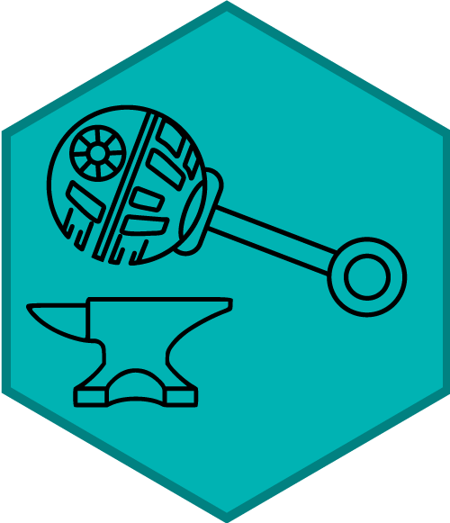

---
format:
  html:
    page-layout: full
sidebar: false
toc: false
title-meta: "ICIS 2026 Workshop: From Screen to Scene"
description-meta: "Half-day ICIS 2026 workshop on shared principles in screen-based and head-mounted eye-tracking for infant research."
keywords: "devstart, ICIS 2026, eye-tracking, infant research, screen-based eye-tracking, head-mounted eye-tracking, AOI, time windows, preprocessing, computer vision"
---

```{=html}
<div class="responsive-section">
  <div class="text-content">
    <div class="title">
      From Screen to Scene
      Shared Principles in Screen-Based<br>
      and<br>
      Head-Mounted Eye-Tracking
    </div>
  </div>
  <div class="image-content">
    <a href="devstart.org" target="_blank" rel="noopener noreferrer">
      
    </a>
  </div>
</div>

<div class="badge-container">
  <span class="badge rounded-pill bg-light big-badge">
    <span class="big-text">06 June 2026</span><br>
    <span class="small-text">ICIS 2026</span>
  </span>
</div>
```

## Workshop Overview

This half-day workshop bridges the methodological gap between screen-based and head-mounted eye-tracking systems in infant research. Participants will develop a unified conceptual framework for understanding both approaches and gain practical implementation strategies for their own research.

We will compare how screen-based systems support precise measurement of gaze patterns to controlled stimuli, while head-mounted systems make it possible to study natural exploratory behavior and real-world object interactions. The main goal is to show that, despite differences in data collection, both approaches rely on shared analytical concepts.

## Learning Objectives

By the end of the workshop, participants will be able to:

- Evaluate whether screen-based or head-mounted eye-tracking best fits their research question.
- Identify shared analytical principles across both systems.
- Understand how Areas of Interest and Time Windows of Interest transfer across paradigms.
- Recognize preprocessing challenges in head-mounted eye-tracking data.
- Adapt screen-based analytical frameworks to mobile eye-tracking contexts.

## Practical Materials

Here you can find simple Python examples for video tracking. These examples are intended as starting points for exploring tracking workflows after the workshop.

::: {.button-container}

:::


### Scrips

inside the dowloaded folder you will find two examples:
- `HandTracking_example.py` - tracks hands in a video and saves hand landmark data.
- `ColorTracking_Example.py` - tracks colored objects in a video and saves color position data.

### Setup

Install Pixi from [pixi.sh/latest](https://pixi.sh/latest/), then install the project environment from the downloaded folder:

```bash
pixi install
```

## Run The Examples

Run the hand-tracking example:

```bash
pixi run python Examples/HandTracking_example.py
```

Run the color-tracking example:

```bash
pixi run python Examples/ColorTracking_Example.py
```

The videos are not included in this folder. Use your own video and update the video path in the script if needed.

## Models And Inputs

For hand tracking, download the MediaPipe hand model from:

[MediaPipe hand landmarker model](https://storage.googleapis.com/mediapipe-models/hand_landmarker/hand_landmarker/float16/1/hand_landmarker.task)

Save it as:

```text
Models/hand_landmarker.task
```

The color-tracking example does not need a model. It uses color ranges inside the script. You can adapt the HSV color ranges in `COLOR_BANDS` for your own video.


